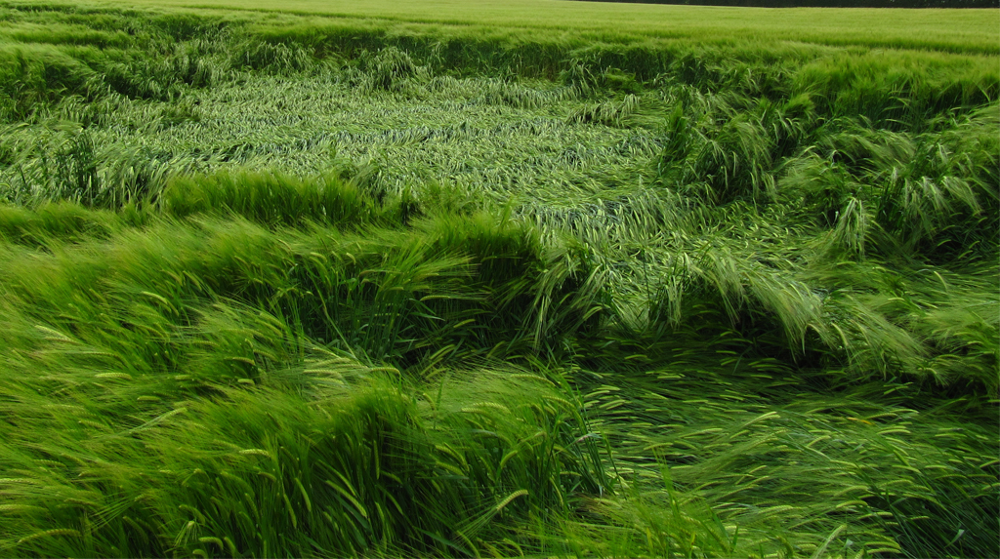
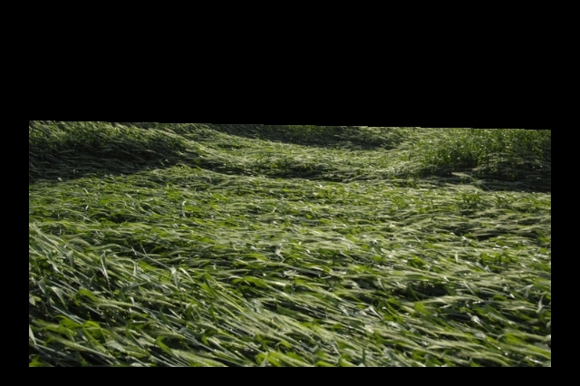
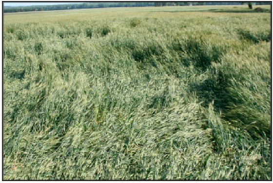
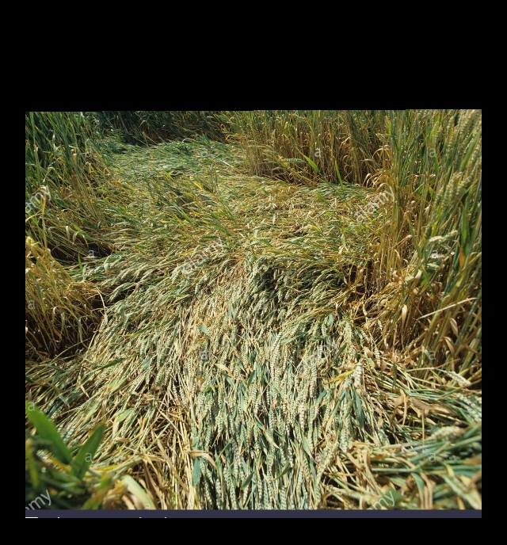
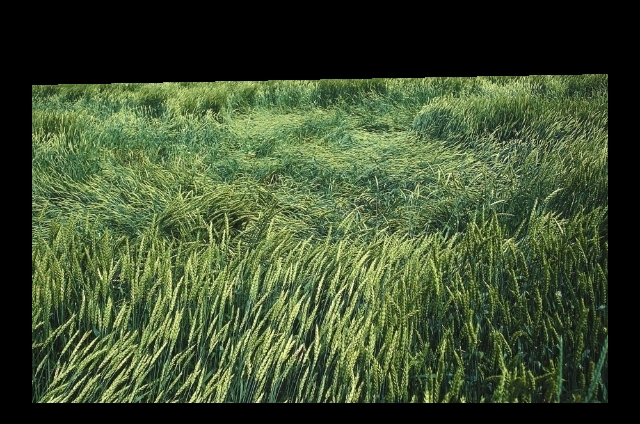
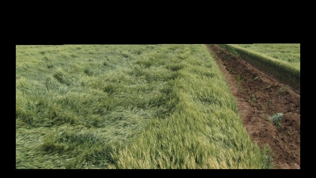
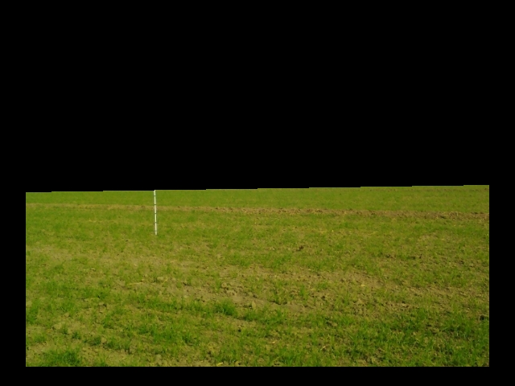
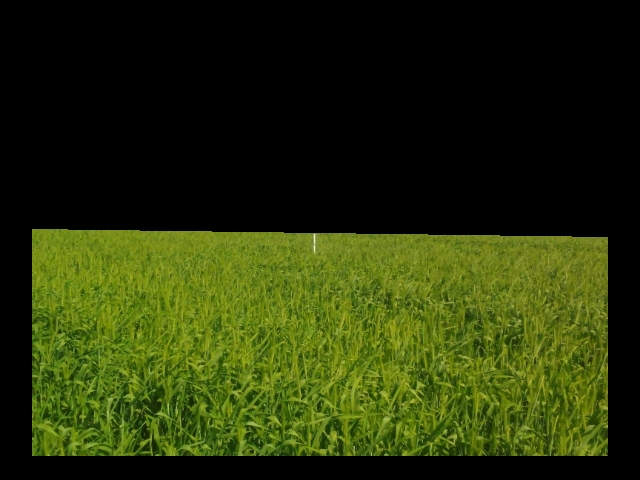
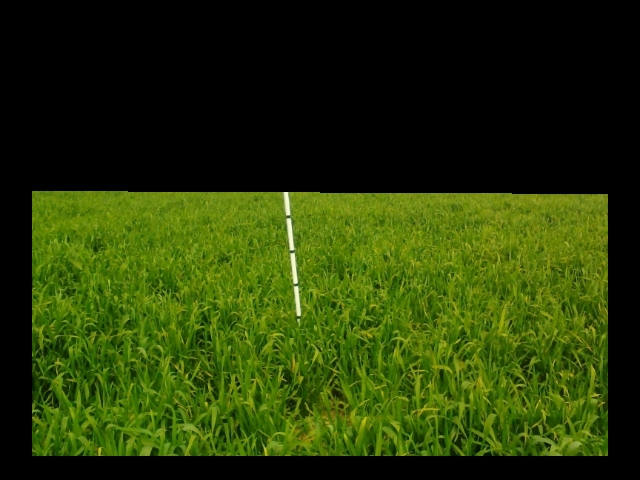

# Wheat Lodging Classifier

This repository walks through the simple process of retraining an inception_v3 model to identify wheat growing areas that are damaged by lodging. 

Lodging is the collapse of the cereal stem when it can no longer support its own weight. All cereal crops and all varieties are susceptible to varying degrees. Two types of lodging occur in cereals: root lodging and stem failure. Root lodging occurs early in the season and it is the most common type of lodging. Stem failure or stem breakage occurs later in the season as the stalk becomes more brittle due to crop maturation.

Severe lodging is very costly due to its effects on grain formation and associated harvesting problems and losses. It takes about twice the time to harvest a lodged crop than a standing one. Secondary growth in combination with a flattened crop makes harvesting difficult and can subsequently lead to poor grain quality and low yields.


### Example of Lodging



 ---
# Batch labeling of Lodging Events

The folowing notebook shows how new images can be classified, viewed, and labels stored for later use. 
[Scripts/Batch_Label_New_Images.ipynb](./Batch_Label_New_Images.ipynb) 


 ---
 # Simplified Train and Classify Lodging Events

The following code was used to set up, train, and predict from tensorflow inception_v3 

```
# install anaconda python

# create anaconda environment named tensorflow with needed modules
conda create -n tensorflow scipy matplotlib etc  etc  etc

# activate the environment 
source activate tensorflow 

# from bash install a few more things
$ pip install "tensorflow>=1.7.0"
$ pip install tensorflow-hub
 ```
 
For HP cluster only:
```
# for server only
# module load git-lfs
# module load git/1.8.3.1
# module load anaconda/4.3.1 cuda/toolkit/9.0
# /c1/modulefiles/glibc/2.17.sh
```
 
## Organize and preprocess training images 

Here I used Koen Hufkens cropmonitor library to rotate, scale, and mask areas of interest (AOI) for each training and testing image. See his R package [here](https://github.com/khufkens/cropmonitor) 

My workflow is a little different than his, to view mine please go to: [Scripts/OpenImageLabels.R](./Scripts/OpenImageLabels.R) 

In the end I had 2,415 examples of normal crop and 105 examples of wheat with lodging damage. These are organized into two folders, where the folder names are labels. 


 
 
## Retrain Inception_v3

Here we apply transfer learning by utlizing the pretrained inception_v3 model. The following takes about 24 hours to run on a 6 core i7, (NO GPU) 

```
### desktop version
# based on: https://www.tensorflow.org/tutorials/image_retraining

python retrain.py --image_dir /media/ssd/crop_image_classifier/Data/LodgingLabels  --flip_left_right True --random_brightness=5 --print_misclassified_test_images
# output files are written to /tmp/ by default

#To launch TensorBoard, run this command during or after retraining:
tensorboard --logdir /tmp/retrain_logs
#Once TensorBoard is running, navigate your web browser to localhost:6006 to #view the TensorBoard.
```

From tensorboard we can see accuracy of each training and validation step. 


## Out-of-Sample predictions

The following is used to predict labels for new images. You simply point label_iamge.py to the location where your tensorfow outputs are including your graph, labels, and the path to the image you want to try to classify.

Although these are early tests we see what appears to be a high out-of-sample level of accuracy. There are a few exceptions where exposed soil and bright images interfer with the prediction. These no doubt could be avoided by providing more training data. 

```
# Download script for predctions
curl -LO https://github.com/tensorflow/tensorflow/raw/master/tensorflow/examples/label_image/label_image.py

#apply trained model
python label_image.py --graph=/tmp/output_graph.pb --labels=/tmp/output_labels.txt --input_layer=Placeholder --output_layer=final_result \
--image=/media/ssd/crop_image_classifier/Data/TestingImages_AOI/A.jpg
```


returns:
```
yes 0.745566
no 0.254434
```
 ---


returns:
```
no 0.7324
yes 0.2676
``` 
 ---


returns:
```
yes 0.521162
no 0.478838
```  
 ---


returns:
```
yes 0.976884
no 0.0231155
```  
 ---


returns:
```
yes 0.874714
no 0.125286
```  
 ---


returns:
```
yes 0.998464
no 0.00153608
```  
 ---


returns:
```
no 0.827629
yes 0.172371
```  
 
## Test on healthy crop examples

 ---


returns:
```
no 0.997799
yes 0.00220066
```  

 ---


returns:
```
no 0.975636
yes 0.0243636
```  
 ---


returns:
```
no 0.998131
yes 0.00186947
```  